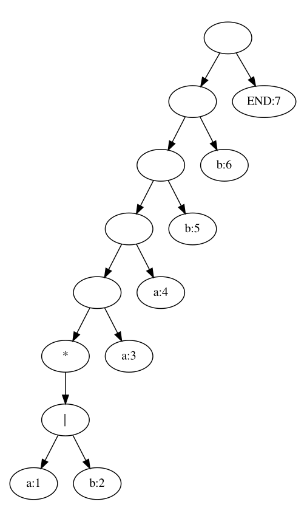

# Лабораторная работа №1. Распознавание цепочек регулярного языка

Студент ИУ7-22М 22.02.2024 Ларин В.Н. 

## Задание
Напишите программу, которая в качестве входа принимает произвольное регулярное выражение, и выполняет следующие преобразования:
1) Преобразует регулярное выражение непосредственно в ДКА.
2) По ДКА строит эквивалентный ему КА, имеющий наименьшее возможное количество состояний. Указание. Воспользоваться алгоритмом, приведенным по адресу http://neerc.ifmo.ru/wiki/index.php?title=Алгоритм_Бржозовского
3) Моделирует минимальный КА для входной цепочки из терминалов исходной грамматики.


## Тестирование

| Регулярное выражение  | Проверяемое выражение | Ожидаемый результат | Результат        | Комментарий |
| --------------------- | --------------------- | ------------------- | ---------------- | ----------- |
| `(a\|b)*aabb`         | `aabb`                | Соответствует       | Соответствует    |
| `(a\|b)*aabb`         | `aabbaabb`            | Соответствует       | Соответствует    |
| `(a\|b)*aabb`         | `aabbaabbb`           | Не соответствует    | Не соответствует |
| `a((a*)\|b)*ab(b\|c)` | `aaababc`             | Соответствует       | Соответствует    |
| `a((a*)\|b)*ab(b\|c)` | `aaababb`             | Соответствует       | Соответствует    |
| `a((a*)\|b)*ab(b\|c)` | `aabababb`            | Соответствует       | Соответствует    |
| `a((a*)\|b)*ab(b\|c)` | `babababb`            | Не соответствует    | Не соответствует |
| `a*\|c*\|xr`          | `aaaar`               | Соответствует       | Соответствует    |
| `a*\|c*\|xr`          | `xr`                  | Соответствует       | Соответствует    |
| `a*\|c*\|xr`          | `ccr`                 | Соответствует       | Соответствует    |
| `a*\|c*\|xr`          | `r`                   | Соответствует       | Соответствует    |
| `a*\|c*\|xr`          | `xxxr`                | Не соответствует    | Не соответствует |

## Результаты работы

Примеры построения для регулярного выражения `(a\|b)*aabb`

### Дерево разбора



### Детерминированный конечный автомат


### Минимизация конечного автомата

1. Оборот автомата
   
    
    

2. Минимизация

    

3. Оборот

    

4. Минимизация

    
    

## Контрольные вопросы

1) Какие из следующих множеств регулярны? Для тех, которые регулярны, напишите регулярные выражения.
    1. Множество цепочек с равным числом нулей и единиц.
    1. Множество цепочек из {0, 1}* с четным числом нулей и нечетным числом единиц.
    1. Множество цепочек из {0, 1}*, длины которых делятся на 3.
    1. Множество цепочек из {0, 1}*, не содержащих подцепочки 101
2) Найдите праволинейные грамматики для тех множеств из вопроса 1, которые регулярны.
3) Найдите детерминированные и недетерминированные конечные автоматы для тех множеств из вопроса 1, которые регулярны.
4) Найдите конечный автомат с минимальным числом состояний для языка, определяемого автоматом M = ({A, B, C, D, E}, {0, 1}, d, A, {E, F}), где функция в задается таблицей

| Состояние | Вход |     |
| --------- | ---- | --- |
|           | 0    | 1   |
| A         | B    | C   |
| B         | E    | F   |
| C         | A    | A   |
| D         | F    | E   |
| E         | D    | F   |
| F         | D    | E   |


### Множество цепочек с равным числом нулей и единиц.

$L = \{0,1\}^n$, где $n \in R$ и число нулей и единиц одинако.

Воспользуемся леммой о накачке.

Рассмотрим язык $L_1=010^n1^n$, который включен в $L$ 

Для фиксированного $n$ выберем слово $w=010^n1^n$. Заметим, что при любом разбиении $w$ на $x$,$y$,$z$ слово $y$ не пусто (по условию леммы) и содержит только символы 0 и 1. Это означает, что при $k=0$ слово $xy^kz$ либо не содержит символов 01, либо количество символов 0 меньше $n$. В обоих случаях полученное слово не принадлежит языку. Значит язык $L_1$ нерегулярный. Следовательно и $L$ нерегулярен.


###  Множество цепочек из {0, 1}* с четным числом нулей и нечетным числом единиц.

Доказательство регулярности языка можно привести только построением его РВ или его КА.

Построим РВ с четным кол-вом нулей и единиц: 
```
((0110)|(1001)|(1010)|(0101)|(11)|(00))*
```

Теперь добавим единицу в середину выражения


```
((0110)|(1001)|(1010)|(0101)|(11)|(00))*1((0110)|(1001)|(1010)|(0101)|(11)|(00))*
```

```
S -> 0110S
S -> 1001S
S -> 1010S
S -> 1010S
S -> 0101S
S -> 11S
S -> 00S
S -> 1B
B -> 0110B
B -> 1001B
B -> 1010B
B -> 1010B
B -> 0101B
B -> 11B
B -> 00B
B -> \eps
```


### Множество цепочек из {0, 1}*, длины которых делятся на 3.


```
((0|1)(0|1)(0|1))*
```

```

S -> 0A
S -> 1A
S -> \eps
A -> 0B
A -> 1B
B -> 0S
B -> 1S

```


### Множество цепочек из {0, 1}*, не содержащих подцепочки 101

Другими словами в цепочке не может встречаться ноль разово.
Т.е. ноль может быть 2 или более раз.

```
((000*)|1)*
```

```
S -> 00A
S -> 1S
A -> 0A
A -> 1S
S -> \eps
```


### Минимизация автомата

| Состояние | Вход |     |
| --------- | ---- | --- |
|           | 0    | 1   |
| A         | B    | C   |
| B         | E    | F   |
| C         | A    | A   |
| D         | F    | E   |
| E         | D    | F   |
| F         | D    | E   |


## Список дополнительной литературы

1. Построение по НКА эквивалентного ДКА, алгоритм Томпсона| https://neerc.ifmo.ru/wiki/index.php?oldid=85540


## Текст программы

```py

from graphviz import Digraph


class Node:
    def __init__(self, v = None, l = None, r = None):
        self.left = l
        self.right = r
        self.value = v
        self.followpos = []
        self.label_i = ''
    def copy(cur):
        return Node(cur.value, cur.left, cur.right)
    left = None
    right = None
    value = None

    def show_tree(pt, dot = None, show_params=False):
        if not dot:
            dot = Digraph()
        label = str(pt.value) + (":" + str(pt.label_i) if pt.label_i else "") 
        def nodes_to_i(nodes):
            return [node.i for node in nodes]
        if show_params:
            label = label + "(" + str(pt.nullable) + ", " +  str(nodes_to_i(pt.firstpos))+ ", " +  str(nodes_to_i(pt.lastpos))+ ", " +  str(nodes_to_i(pt.followpos))+ ")" 
        dot.node(str(pt.i), label)
        if pt.left:
            dot.edge(str(pt.i), str(pt.left.i))
            pt.left.show_tree(dot, show_params=show_params)
        if pt.right:
            dot.edge(str(pt.i), str(pt.right.i))
            pt.right.show_tree(dot, show_params=show_params)
        return dot
    def count_i(self, i = 0):
        self.i = i
        if self.left:
            self.left.count_i(i*2+1)
        if self.right:
            self.right.count_i(i*2+2)

    def count_nullable(self):
        if self.left:
            self.left.count_nullable()
        if self.right:
            self.right.count_nullable()

        if self.value == '*':
            self.nullable = True
        elif self.value== '|':
            self.nullable = self.left.nullable or self.right.nullable
        else:
            self.nullable = False
        return self.nullable
    def count_firstpos(self):
        if self.left:
            self.left.count_firstpos()
        if self.right:
            self.right.count_firstpos()

        if self.value in ['*', '+']:
            self.firstpos = self.left.firstpos.copy()
        elif self.value == '':
            self.firstpos = self.left.firstpos.copy()
            if self.left.nullable:
                self.firstpos += self.right.firstpos
        elif self.value== '|':
            self.firstpos = self.left.firstpos + self.right.firstpos 
        else:
            self.firstpos = [self]
        return self.firstpos
    def count_lastpos(self):
        if self.left:
            self.left.count_lastpos()
        if self.right:
            self.right.count_lastpos()

        if self.value in ['*', '+']:
            self.lastpos = self.left.lastpos.copy()
        elif self.value == '':
            self.lastpos = self.right.lastpos.copy()
            if self.right.nullable:
                self.lastpos += self.left.lastpos
        elif self.value== '|':
            self.lastpos = self.left.lastpos + self.right.lastpos 
        else:
            self.lastpos = [self]
        return self.lastpos
    
    def count_followpos(self):
        if self.left:
            self.left.count_followpos()
        if self.right:
            self.right.count_followpos()
        if self.value == '':
            for i in self.left.lastpos:
                i.followpos += self.right.firstpos
        elif self.value == '*':
            for i in self.lastpos:
                i.followpos += self.firstpos

    def foreach_deep(self, funcIn = None, FuncOut = None):
        if funcIn:
            funcIn(self)
        if self.left:
            self.left.foreach_deep(funcIn, FuncOut)
        if self.right:
            self.right.foreach_deep(funcIn, FuncOut)
        if FuncOut:
            FuncOut(self)
        

def buildParseTree(INITexpr):

    def get_expr(exp):
        def cat_exprs(left, right):
            return Node('', left, right) 
        print('DBG: EXPR: ', "".join(exp))
        s = 0
        tree = None
        if exp[s] == '(':
            s += 1
            e, n = get_expr(exp[s:])
            s += n
            tree = e
            while exp[s] != ')':
                e, n = get_expr(exp[s:])
                s += n
                tree = cat_exprs(tree, e)
        elif exp[s] not in ['+', '*', '|', ')']:
            tree = Node(exp[s])
        else:
            raise Exception('Waiting for "(", term: ' +  "".join(exp) + ' '+ str(s))
        s += 1
        if s < len(exp)and exp[s] in ['+', '*']:
                tree = Node(exp[s], tree)
                s+=1

        if s < len(exp) and exp[s] == '|':
                next_expr, l = get_expr(exp[s+1:])
                return Node('|', tree, next_expr), s + 1 + l
        
        return tree, s
    print(INITexpr)
    x, r =  get_expr(['('] + INITexpr + [')'])
    return x


def make_ka(root: Node, symbols, end_symb='#'):
    def make_state(nodes):
        return tuple(sorted([node.label_i for node in nodes]))
    
    def is_end(nodes):
        for node in nodes:
            if node.value == end_symb:
                return True
        return False
    Dstates = []
    
    table = {}
    queue = [root.firstpos]

    last = []
    while len(queue):
        state = queue.pop()
        Dstates += [make_state(state)]

        for c in symbols:
            U = []
            for p in state:
                if p.value == c:
                    U += p.followpos
            U = list(set(U))
            if not len(U): 
                continue
            
            if make_state(U) not in Dstates:
                queue.append(U)

           

            table[make_state(state), c] = [make_state(U)]

            print(make_state(state), c, [make_state(U)])

        if is_end(state):
                last += [make_state(state)]
    
    return [Dstates[0]], last, table    


def fix_names(first, last, table):
    names = []

    for f,v in table:
        if f not in names:
            names += [f]
        for t in table[f,v]:
            if not t in names:
                names += [t]
    newTable = {}
    for f,v in table:
        newTable[(names.index(f), v)]  = [names.index(t) for t in table[f,v]]
    return [names.index(t) for t in first], [names.index(t) for t in last], newTable

def print_ka(first, end, Dtran):
    g = Digraph()

    g.node('S', 'Start')
    g.node('E', 'End')

    for i in first:
        g.edge('S', str(i))
    
    for i in end:
        g.edge(str(i), 'E')
        

    for f,v in Dtran:
        for t in Dtran[(f,v)]:
            g.node(str(f))
            g.node(str(t))
            g.edge(str(f), str(t), v )

    return g


def reverseKa(first, last, Dtran):
    newDtran = {}
    for f,v in Dtran:
        for t in Dtran[(f,v)]:
            if (t,v) not in newDtran:
                newDtran[(t, v)] = []     
            newDtran[(t, v)] += [f]
    return last, first, newDtran


def toDFA(first, last, table):
    """
    Алгоритм Томпсона строит по НКА эквивалентный ДКА следующим образом:

    Начало.
    Шаг 1. Помещаем в очередь Q
        множество, состоящее только из стартовой вершины.
    Шаг 2. Затем, пока очередь не пуста выполняем следующие действия:
        Достаем из очереди множество, назовем его q
        Для всех c∈Σ
        посмотрим в какое состояние ведет переход по символу c из каждого состояния в q. Полученное множество состояний положим в очередь Q
        только если оно не лежало там раньше. Каждое такое множество в итоговом ДКА будет отдельной вершиной, в которую будут вести переходы по соответствующим символам.
        Если в множестве q

        хотя бы одна из вершин была терминальной в НКА, то соответствующая данному множеству вершина в ДКА также будет терминальной.

    Конец.
    """
    def nodes_to_state_name(l):
        return tuple(set(l))

    symbols = []
    for _, v in table:
        symbols += [v]
    symbols = list(set(symbols))

    queue = [first.copy()]

    newTable = {}
    states = []

    while len(queue):
        nodes = queue.pop()
        states.append(nodes_to_state_name(nodes))
        for c in symbols:
            state = []
            for node in nodes:
                if (node, c) in table:
                    state += table[(node,c)]
            state = nodes_to_state_name(state)

            if not len(state):
                continue
            newTable[(nodes_to_state_name(nodes), c)] = [state]
            
            if state not in states:
                queue.append(state)
            
       
    def intersection(lst1, lst2):
        lst3 = [value for value in lst1 if value in lst2]
        return lst3


    return [nodes_to_state_name(first)], [
        state for state in states if intersection(state, last)
    ], newTable


def check_ka(st, fir, las, table):
    state = fir[0]
    for c in st:
        print(state, c)
        if (state, c) not in table:
            return False
        state = table[(state,c)][0]

    return state in las


def prepare_all(regK):
    end_symb = 'END'
    pt = buildParseTree(list(regK) + [end_symb])


    pt.count_i()

    pt.count_nullable()
    pt.count_firstpos()
    pt.count_lastpos()

    pt.count_followpos()

    nodes = []
    def make_nodes(node):
        if node.value not in ('+', '|', '', '*'):
            nodes.append(node)

    pt.foreach_deep(FuncOut=make_nodes)
    for i, node in enumerate(nodes, 1):
        node.label_i = i
    symbols = list(set([node.value for node in nodes]))
    dfa = make_ka(pt, symbols, end_symb=end_symb)

    steps_V = []

    modified = dfa
    
    def get_nodes(table):
        nodes = set()
        for i,v in table:
            nodes.add(i)
            for g in table[(i,v)]:
                nodes.add(g)
        return nodes
    def step(ins):
        fix = fix_names(*ins)
        r = reverseKa(*fix)
        dfa = toDFA(*r)
        fix2 = fix_names(*dfa)
        steps_V.append([fix, r, dfa, fix2])
        return fix2 
    delta = 1
    while delta != 0:
        old = len(get_nodes(modified[2]))
        modified = step(step(modified))

        delta = old - len(get_nodes(modified[2]))
    
    return pt, dfa, modified, steps_V


regK = "a((a*)|b)*ab(b|c)"
z = prepare_all(regK)

import traceback
def change_reg():
    global regK, z
    print("""
Допустимые терминальные символы: *, +, |, (, )
Иные символы воспринимаются как нетерминальные
          """)
    x = input("Введите новое регулярное выражение: ")
    
    try:
        z = prepare_all(x)
    except Exception as e:
        print(traceback.format_exc())
        input("Произошла ошибка" + str(e))
        return change_reg()
    regK = x

def show_dla():
    z[0].show_tree().view()
def show_dfa():
    print_ka(*z[1]).view()
def show_mdfa():
    print_ka(*z[2]).view()
def show_mdfa_steps():
    for s in z[3]:
        print_ka(*s).view()
        input()
   
def init_dfa():

    s = input("Введите строку (для выхода нажмите <ENTER>): ")
    if s:
        res = check_ka(s, *z[2])
        print(res)
        init_dfa()
    

import os
os.system('clear')

while True:
    os.system('clear')
    x = -1
    try:
        x = int(input("""
Текущее регулярное выражение {:}

0. Указать выражение  
1. Показать ДЛА
2. Показать ДКА
3. Показать МДКА
4. Моделировать МДКА
5. Показать по шагам минимизацию ДКА (debug)

Введите пункт меню: """.format(regK)))
    except:
        pass
    
    actions = [
        change_reg,
        show_dla,
        show_dfa,
        show_mdfa,
        init_dfa,
        show_mdfa_steps,
    ]

    if x < 0 or x > len(actions):
        input("Input error")
        continue
    
    actions[x]()
```